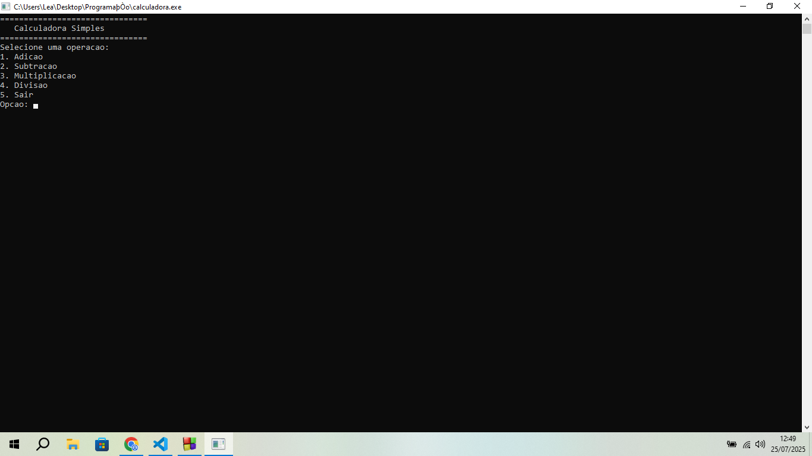

# Calculadora-em-C

## Descrição do projeto:
Uma calculadora baseada em texto feita em C

### Imagem do projeto em execução:

### Pré-requesitos:
Você deve baixar o arquivo em C, e executa-lo do jeito que conseguir.

### Usos e exemplos:
Você pode usa-lá para realizar operações matemáticas simples

### Estrutura do projeto:
Essa calculadora foi feita em C
